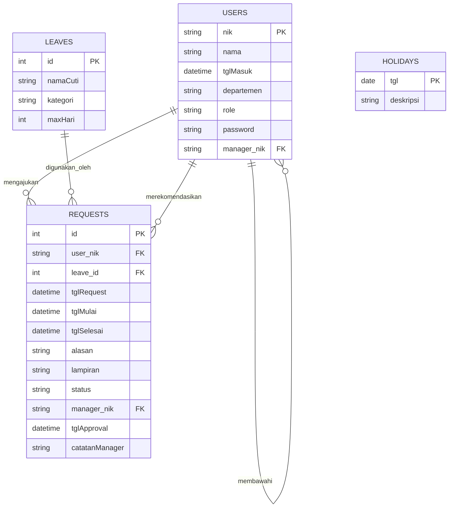
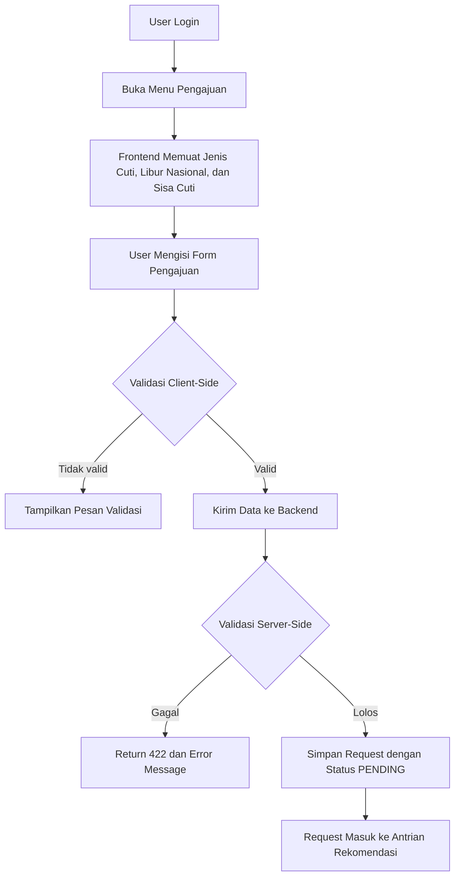
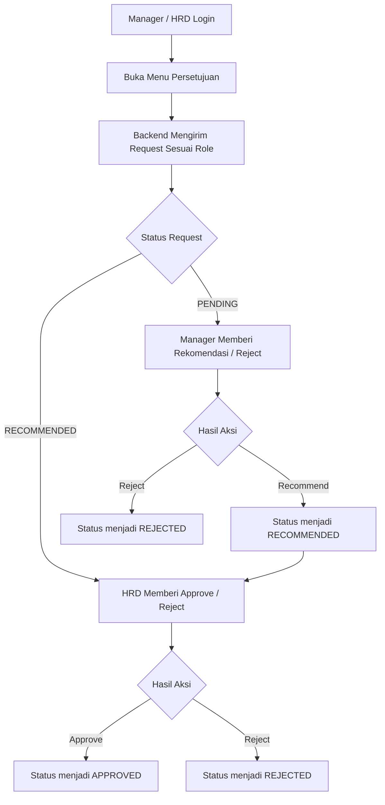
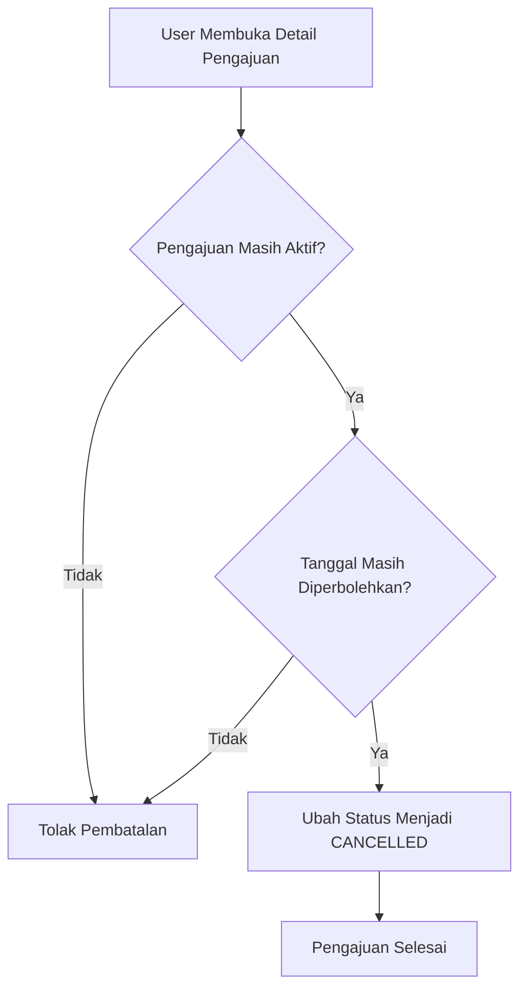

# BAB III
# PERANCANGAN SISTEM DAN ALUR BISNIS

## 3.1 Tujuan Perancangan

Perancangan sistem ini bertujuan untuk menyediakan mekanisme pengelolaan cuti yang lebih tertib, terdokumentasi, dan mudah diaudit. Sistem dirancang untuk mendukung kebutuhan operasional perusahaan dalam mengelola pengajuan cuti, validasi aturan bisnis, proses persetujuan bertingkat, dan pelaporan periodik.

## 3.2 Use Case Sistem

### 3.2.1 Aktor Sistem

| Aktor | Deskripsi |
|---|---|
| Staff | Karyawan yang mengajukan cuti dan memantau status pengajuan. |
| Manager | Pihak yang memberikan rekomendasi terhadap pengajuan cuti bawahan. |
| HRD | Pihak yang melakukan persetujuan akhir, administrasi data karyawan, dan pembuatan laporan. |

### 3.2.2 Daftar Use Case

| Use Case | Aktor |
|---|---|
| Login | Staff, Manager, HRD |
| Melihat Dashboard | Staff, Manager, HRD |
| Mengajukan Cuti | Staff |
| Membatalkan Pengajuan | Staff |
| Memberi Rekomendasi | Manager, HRD |
| Menyetujui / Menolak Cuti | HRD |
| Melihat Laporan | HRD |
| Mengelola Data Karyawan | HRD |
| Melihat Struktur Organisasi | HRD |

## 3.3 Diagram Use Case Siap Tempel ke Word

### 3.3.1 Versi Mermaid

```mermaid
usecaseDiagram
    actor Staff as S
    actor Manager as M
    actor HRD as H

    rectangle "Sistem Informasi Cuti" {
        (Login) as UC1
        (Melihat Dashboard) as UC2
        (Mengajukan Cuti) as UC3
        (Membatalkan Pengajuan) as UC4
        (Memberi Rekomendasi) as UC5
        (Menyetujui / Menolak Cuti) as UC6
        (Melihat Laporan) as UC7
        (Mengelola Data Karyawan) as UC8
        (Melihat Struktur Organisasi) as UC9
    }

    S --> UC1
    S --> UC2
    S --> UC3
    S --> UC4

    M --> UC1
    M --> UC2
    M --> UC5
    M --> UC6

    H --> UC1
    H --> UC2
    H --> UC5
    H --> UC6
    H --> UC7
    H --> UC8
    H --> UC9
```

### 3.3.2 Versi Teks untuk Word

```text
Staff
  - Login
  - Melihat Dashboard
  - Mengajukan Cuti
  - Membatalkan Pengajuan

Manager
  - Login
  - Melihat Dashboard
  - Memberi Rekomendasi
  - Menyetujui / Menolak Cuti

HRD
  - Login
  - Melihat Dashboard
  - Memberi Rekomendasi
  - Menyetujui / Menolak Cuti
  - Melihat Laporan
  - Mengelola Data Karyawan
  - Melihat Struktur Organisasi
```

## 3.4 Diagram ERD Siap Tempel ke Word

### 3.4.1 Versi Mermaid



### 3.4.2 Versi Teks untuk Word

```text
USERS (nik, nama, tglMasuk, departemen, role, password, manager_nik)
  - users.nik -> requests.user_nik
  - users.nik -> users.manager_nik
  - users.nik -> requests.manager_nik

LEAVES (id, namaCuti, kategori, maxHari)
  - leaves.id -> requests.leave_id

REQUESTS (id, user_nik, leave_id, tglRequest, tglMulai, tglSelesai, alasan, lampiran, status, manager_nik, tglApproval, catatanManager)

HOLIDAYS (tgl, deskripsi)
```

## 3.5 Diagram Alur Bisnis Pengajuan Cuti

### 3.5.1 Versi Mermaid



### 3.5.2 Versi Teks untuk Word

```text
1. User login ke sistem.
2. User membuka menu pengajuan cuti.
3. Sistem menampilkan daftar jenis cuti, hari libur, dan sisa cuti.
4. User mengisi form pengajuan.
5. Sistem melakukan validasi awal di sisi client.
6. Jika valid, data dikirim ke backend.
7. Backend melakukan validasi server-side.
8. Jika lolos, sistem menyimpan request dengan status PENDING.
9. Request masuk ke antrian rekomendasi.
```

## 3.6 Diagram Alur Persetujuan

### 3.6.1 Versi Mermaid



### 3.6.2 Versi Teks untuk Word

```text
1. Manager atau HRD login ke sistem.
2. Pengguna membuka menu persetujuan.
3. Sistem menampilkan request sesuai role.
4. Request dengan status PENDING diproses oleh Manager.
5. Request dengan status RECOMMENDED diproses oleh HRD.
6. Approver dapat memberi rekomendasi, persetujuan, atau penolakan.
7. Sistem memperbarui status request sesuai keputusan.
8. Request selesai pada status APPROVED atau REJECTED.
```

## 3.7 Diagram Alur Pembatalan Cuti

### 3.7.1 Versi Mermaid



### 3.7.2 Versi Teks untuk Word

```text
1. User membuka detail pengajuan cuti.
2. Sistem memeriksa status pengajuan.
3. Sistem memeriksa batas waktu pembatalan.
4. Jika seluruh syarat terpenuhi, status diubah menjadi CANCELLED.
5. Jika syarat tidak terpenuhi, pembatalan ditolak.
```

## 3.8 Tabel Skenario Use Case

### 3.8.1 Login

| Elemen | Keterangan |
|---|---|
| Nama Use Case | Login |
| Aktor | Staff, Manager, HRD |
| Tujuan | Mengakses sistem dengan kredensial yang valid. |
| Prasyarat | Akun pengguna telah terdaftar. |
| Alur Utama | 1. Pengguna membuka halaman login. 2. Pengguna memasukkan NIK dan password. 3. Sistem memverifikasi data. 4. Sistem menerbitkan token. 5. Pengguna diarahkan ke dashboard. |
| Alur Alternatif | Kredensial salah, sistem menampilkan pesan kesalahan. |
| Hasil Akhir | Pengguna berhasil masuk ke sistem. |

### 3.8.2 Mengajukan Cuti

| Elemen | Keterangan |
|---|---|
| Nama Use Case | Mengajukan Cuti |
| Aktor | Staff |
| Tujuan | Mengirim permohonan cuti untuk diproses. |
| Prasyarat | Pengguna telah login. |
| Alur Utama | 1. Pengguna membuka menu pengajuan. 2. Sistem menampilkan form pengajuan. 3. Pengguna mengisi data pengajuan. 4. Sistem memvalidasi input. 5. Sistem menyimpan request dengan status PENDING. |
| Alur Alternatif | Jika input tidak valid, pengajuan ditolak. |
| Hasil Akhir | Request cuti tercatat dalam sistem. |

### 3.8.3 Rekomendasi dan Persetujuan

| Elemen | Keterangan |
|---|---|
| Nama Use Case | Memberi Rekomendasi / Menyetujui Cuti |
| Aktor | Manager, HRD |
| Tujuan | Menentukan keputusan atas request cuti. |
| Prasyarat | Pengguna memiliki role yang sesuai. |
| Alur Utama | 1. Pengguna membuka menu persetujuan. 2. Sistem menampilkan request yang relevan. 3. Pengguna memberi keputusan. 4. Sistem memperbarui status request. |
| Alur Alternatif | Jika ditolak, sistem menyimpan catatan penolakan. |
| Hasil Akhir | Request berubah menjadi RECOMMENDED, APPROVED, atau REJECTED. |

### 3.8.4 Membatalkan Pengajuan

| Elemen | Keterangan |
|---|---|
| Nama Use Case | Membatalkan Pengajuan |
| Aktor | Staff |
| Tujuan | Membatalkan request cuti yang masih memenuhi syarat. |
| Prasyarat | Request masih aktif dan masih dalam batas waktu pembatalan. |
| Alur Utama | 1. Pengguna membuka detail request. 2. Pengguna memilih batal. 3. Sistem memeriksa validitas. 4. Sistem mengubah status menjadi CANCELLED. |
| Alur Alternatif | Jika syarat tidak terpenuhi, pembatalan ditolak. |
| Hasil Akhir | Request tidak lagi aktif. |

### 3.8.5 Mengelola Data Karyawan

| Elemen | Keterangan |
|---|---|
| Nama Use Case | Mengelola Data Karyawan |
| Aktor | HRD |
| Tujuan | Menambah, mengubah, dan menghapus data karyawan. |
| Prasyarat | Pengguna memiliki role HRD. |
| Alur Utama | 1. HRD membuka halaman data karyawan. 2. HRD melakukan aksi CRUD. 3. Sistem memvalidasi data. 4. Sistem menyimpan perubahan. |
| Alur Alternatif | Data tidak valid atau NIK duplikat, proses ditolak. |
| Hasil Akhir | Data karyawan diperbarui sesuai aksi. |

## 3.9 Kesimpulan Bab III

Perancangan sistem menunjukkan bahwa alur kerja aplikasi telah mendukung proses bisnis cuti secara menyeluruh. Mekanisme pengajuan, persetujuan, pembatalan, dan pelaporan telah disusun secara berurutan dan dapat dipertanggungjawabkan secara administratif. Diagram dan tabel pada bab ini dapat langsung dipindahkan ke dokumen Word karena disediakan dalam dua bentuk, yaitu format visual Mermaid dan format teks terstruktur.
