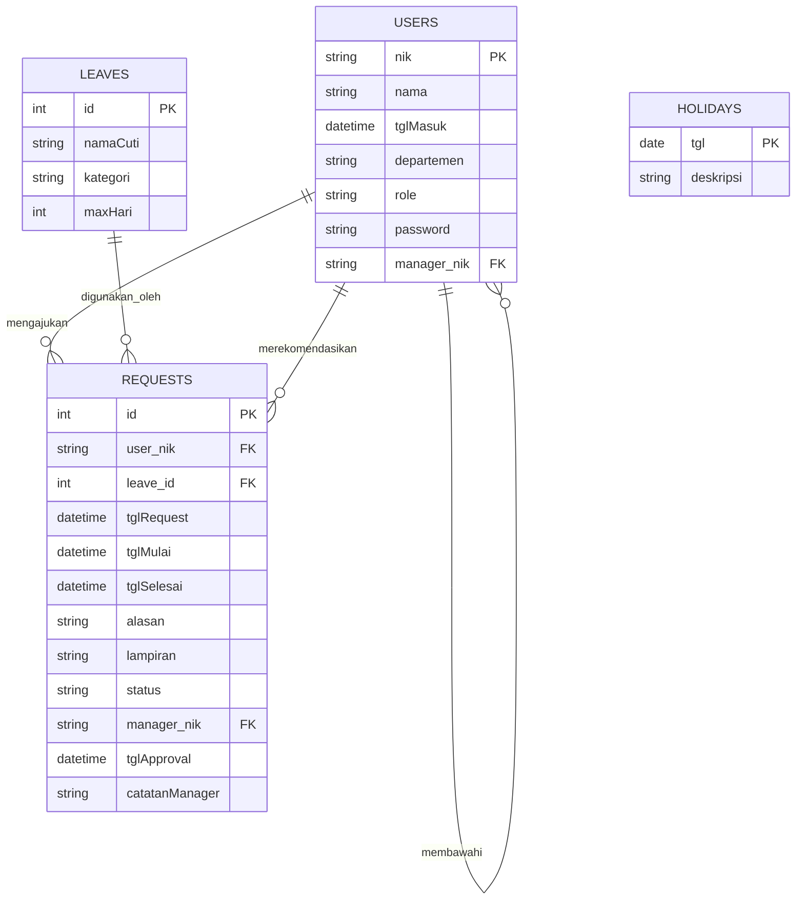
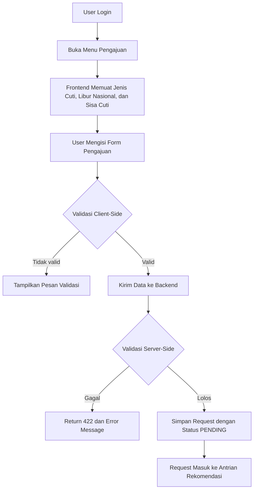
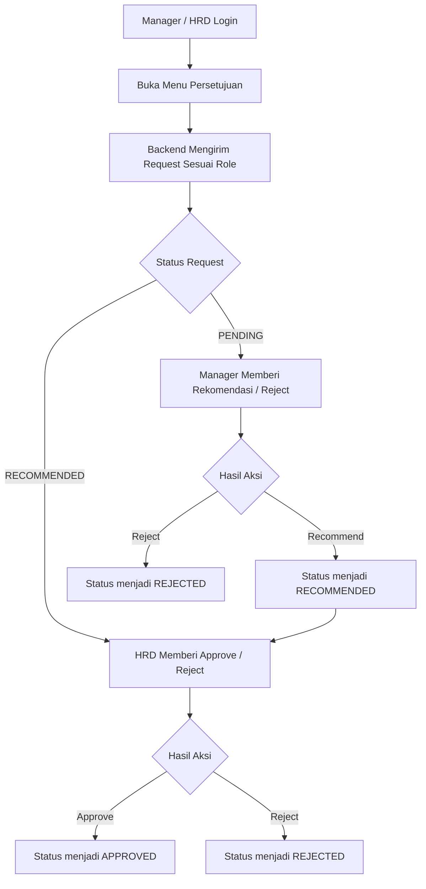
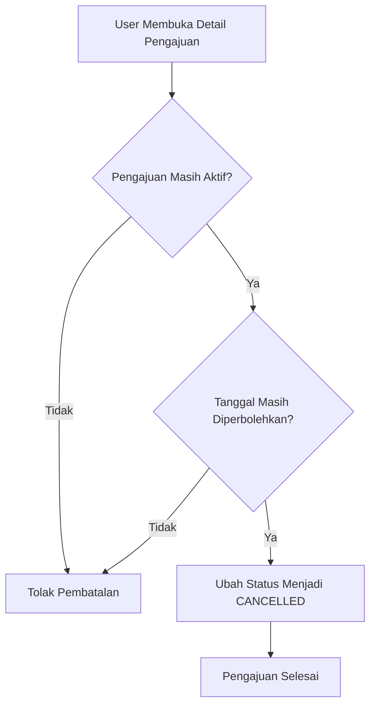

# Diagram Sistem Informasi Cuti SC

Dokumen ini berisi versi diagram yang disusun agar lebih mudah dipindahkan ke dokumen Word. Setiap diagram disediakan dalam bentuk visual Mermaid dan versi teks terstruktur.

## 1. ERD

### Mermaid



### Teks untuk Word

```text
USERS (nik, nama, tglMasuk, departemen, role, password, manager_nik)
LEAVES (id, namaCuti, kategori, maxHari)
REQUESTS (id, user_nik, leave_id, tglRequest, tglMulai, tglSelesai, alasan, lampiran, status, manager_nik, tglApproval, catatanManager)
HOLIDAYS (tgl, deskripsi)

Relasi:
- USERS.nik -> REQUESTS.user_nik
- LEAVES.id -> REQUESTS.leave_id
- USERS.nik -> USERS.manager_nik
- USERS.nik -> REQUESTS.manager_nik
```

## 2. Alur Pengajuan Cuti

### Mermaid



### Teks untuk Word

```text
1. User login.
2. User membuka menu pengajuan.
3. Sistem menampilkan jenis cuti, libur nasional, dan sisa cuti.
4. User mengisi form.
5. Validasi client-side dijalankan.
6. Data dikirim ke backend.
7. Backend melakukan validasi server-side.
8. Jika valid, request disimpan dengan status PENDING.
9. Request masuk ke antrian rekomendasi.
```

## 3. Alur Persetujuan

### Mermaid



### Teks untuk Word

```text
1. Manager atau HRD login.
2. Pengguna membuka menu persetujuan.
3. Sistem menampilkan request sesuai role.
4. Manager memproses status PENDING.
5. HRD memproses status RECOMMENDED.
6. Pengguna memberi keputusan rekomendasi, approval, atau penolakan.
7. Status request diperbarui sesuai hasil keputusan.
```

## 4. Alur Pembatalan Cuti

### Mermaid



### Teks untuk Word

```text
1. User membuka detail pengajuan.
2. Sistem memeriksa status request.
3. Sistem memeriksa batas waktu pembatalan.
4. Jika valid, request dibatalkan.
5. Jika tidak valid, pembatalan ditolak.
```

## 5. Use Case Diagram

### Mermaid

```mermaid
usecaseDiagram
    actor Staff as S
    actor Manager as M
    actor HRD as H

    rectangle "Sistem Informasi Cuti" {
        (Login) as UC1
        (Melihat Dashboard) as UC2
        (Mengajukan Cuti) as UC3
        (Membatalkan Pengajuan) as UC4
        (Memberi Rekomendasi) as UC5
        (Menyetujui / Menolak Cuti) as UC6
        (Melihat Laporan) as UC7
        (Mengelola Data Karyawan) as UC8
        (Melihat Struktur Organisasi) as UC9
    }

    S --> UC1
    S --> UC2
    S --> UC3
    S --> UC4

    M --> UC1
    M --> UC2
    M --> UC5
    M --> UC6

    H --> UC1
    H --> UC2
    H --> UC5
    H --> UC6
    H --> UC7
    H --> UC8
    H --> UC9
```

### Teks untuk Word

```text
Staff: Login, Melihat Dashboard, Mengajukan Cuti, Membatalkan Pengajuan
Manager: Login, Melihat Dashboard, Memberi Rekomendasi, Menyetujui / Menolak Cuti
HRD: Login, Melihat Dashboard, Memberi Rekomendasi, Menyetujui / Menolak Cuti, Melihat Laporan, Mengelola Data Karyawan, Melihat Struktur Organisasi
```
