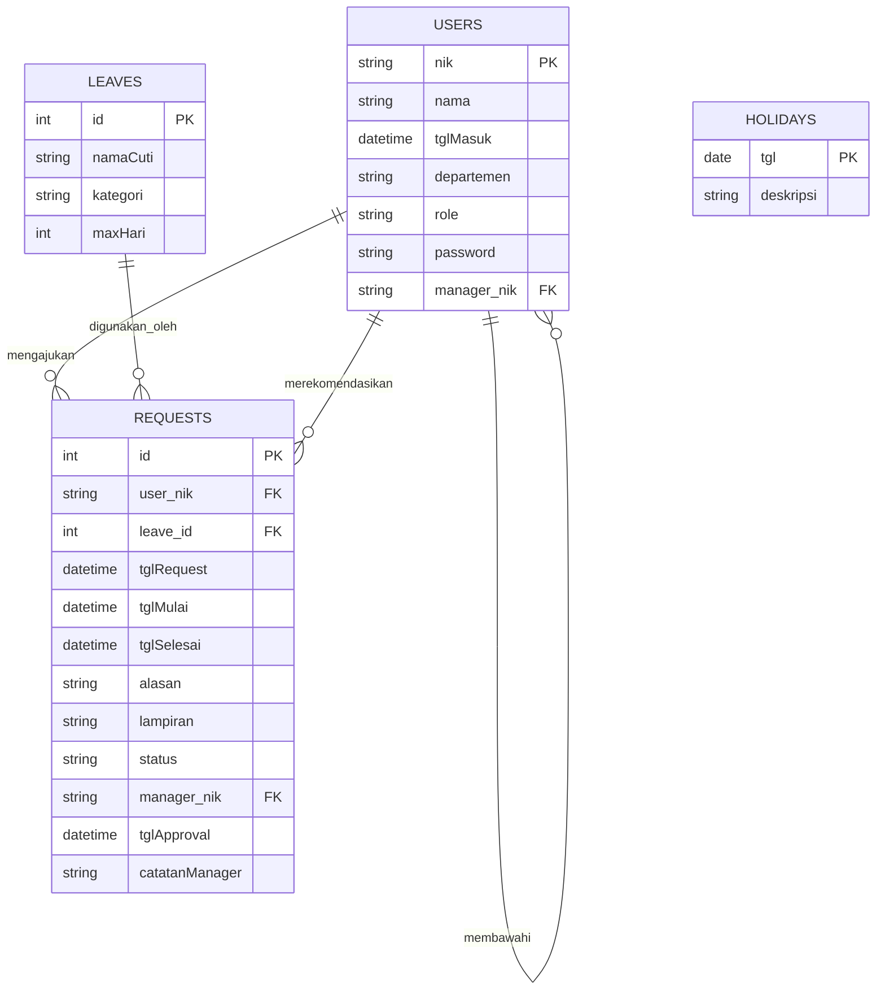
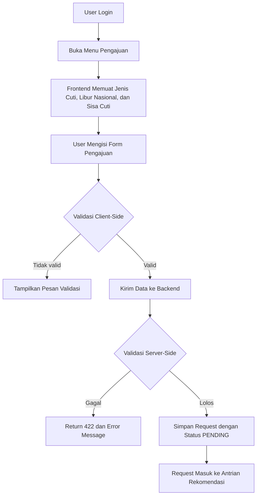
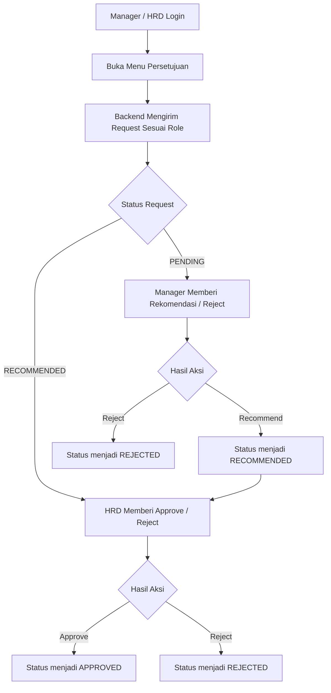
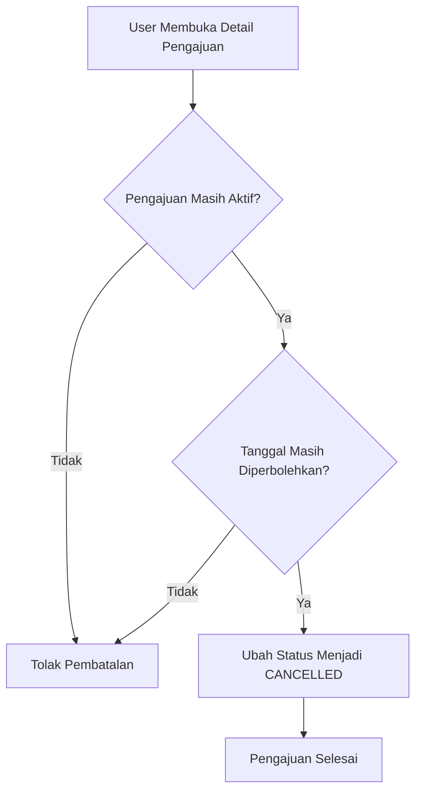

# Dokumentasi Teknis dan Bisnis Sistem Informasi Cuti SC

Dokumen ini disusun berdasarkan analisis codebase aplikasi sistem informasi cuti pada workspace `sc`. Penyusunan dilakukan dengan pendekatan dokumentasi teknis dan bisnis agar dapat digunakan sebagai bahan laporan PKL, skripsi, atau dokumen internal proyek.

## 1. Gambaran Umum Sistem

Sistem informasi cuti ini dibangun dengan arsitektur terpisah antara frontend dan backend. Frontend menggunakan Vue.js sebagai antarmuka pengguna, sedangkan backend menggunakan Laravel sebagai penyedia layanan API, autentikasi, validasi bisnis, dan pengolahan laporan. Sistem memfasilitasi proses pengajuan cuti, persetujuan berjenjang, manajemen data karyawan, serta penyusunan laporan cuti.

Secara fungsional, sistem ini mendukung:

- autentikasi pengguna berdasarkan NIK dan password,
- pengajuan cuti dengan validasi tanggal, kuota, dan lampiran,
- alur persetujuan bertahap oleh Manager dan HRD,
- pemantauan sisa cuti dan riwayat pengajuan,
- pengelolaan data karyawan oleh HRD,
- penyusunan laporan cuti dan export PDF.

## 2. Arsitektur Sistem

### 2.1 Pola Arsitektur

Arsitektur yang diterapkan adalah **decoupled architecture** atau pemisahan frontend-backend. Pola ini memisahkan tanggung jawab sebagai berikut:

- **Frontend Vue.js** menangani rendering antarmuka, routing halaman, interaksi form, modal, tabel, dan validasi awal di sisi client.
- **Backend Laravel** menangani autentikasi token, business logic cuti, validasi server-side, otorisasi role, dan penyediaan data melalui endpoint JSON.
- **Storage Supabase** digunakan untuk penyimpanan lampiran file cuti melalui disk `supabase` pada konfigurasi filesystem.

### 2.2 Struktur Direktori Penting

#### Backend

| Direktori / File | Fungsi |
|---|---|
| `backend/app/Http/Controllers/` | Menyimpan logika utama aplikasi, termasuk login, dashboard, pengajuan, persetujuan, laporan, dan data karyawan. |
| `backend/app/Models/` | Mendefinisikan model Eloquent dan relasi antar entitas bisnis. |
| `backend/routes/api.php` | Menyimpan daftar endpoint API yang dikonsumsi frontend. |
| `backend/resources/views/pdf/` | Template Blade untuk laporan PDF. |
| `backend/config/filesystems.php` | Konfigurasi disk storage, termasuk disk `supabase`. |
| `backend/database/migrations/` | Menyimpan migration bawaan Laravel dan Sanctum yang tersedia di repo. |

#### Frontend

| Direktori / File | Fungsi |
|---|---|
| `frontend/src/views/` | Halaman aplikasi seperti Login, Dashboard, Pengajuan, Persetujuan, Laporan, dan Data Karyawan. |
| `frontend/src/router/index.js` | Routing SPA dan navigation guard berdasarkan token login. |
| `frontend/src/lib/axios.js` | Instance Axios terpusat untuk komunikasi ke backend Laravel. |
| `frontend/src/components/Sidebar.vue` | Navigasi utama aplikasi berdasarkan role pengguna. |
| `frontend/src/views/DataKaryawan/` | Komponen manajemen dan visualisasi struktur organisasi. |

### 2.3 Mekanisme State Management

Frontend tidak menggunakan Pinia atau Vuex. State dikelola secara lokal dengan Composition API Vue, yaitu:

- `ref` untuk data sederhana,
- `reactive` untuk form,
- `computed` untuk data turunan,
- `watch` untuk validasi dan sinkronisasi,
- `onMounted` untuk pengambilan data awal.

Data autentikasi disimpan pada `localStorage`, yaitu token dan objek user. Dengan demikian, state global yang tersedia pada codebase saat ini bersifat ringan dan berbasis halaman.

## 3. Entity Relationship Diagram

Bagian ini disusun dari model dan controller yang tersedia. Perlu dicatat bahwa tabel bisnis utama seperti `leaves`, `requests`, dan `holidays` tidak ditemukan migration-nya pada repository yang ada, sehingga struktur berikut merupakan representasi logis berdasarkan implementasi kode saat ini.



### 3.1 Penjelasan Entitas

#### a. `users`

Entitas `users` menyimpan data karyawan sekaligus akun login. Primary key yang digunakan adalah `nik`, bukan `id` auto increment seperti konvensi Laravel bawaan. Kolom `manager_nik` digunakan untuk menyimpan hubungan atasan langsung.

#### b. `leaves`

Entitas `leaves` menyimpan master jenis cuti. Kolom `namaCuti` menandai nama cuti, `kategori` membedakan cuti normatif dan non-normatif, sedangkan `maxHari` menyimpan batas maksimal durasi cuti untuk jenis tertentu.

#### c. `requests`

Entitas `requests` menyimpan transaksi pengajuan cuti. Entitas ini merupakan pusat proses bisnis karena berisi status pengajuan, tanggal cuti, lampiran, approver, catatan penolakan, serta timestamp approval.

#### d. `holidays`

Entitas `holidays` menyimpan data hari libur nasional yang digunakan untuk validasi tanggal pengajuan cuti.

## 4. Diagram Alur Bisnis

### 4.1 Alur Pengajuan Cuti



### 4.2 Alur Persetujuan



### 4.3 Alur Pembatalan Cuti



## 5. Use Case Diagram

```mermaid
usecaseDiagram
    actor Staff as S
    actor Manager as M
    actor HRD as H

    rectangle "Sistem Informasi Cuti" {
        (Login) as UC1
        (Melihat Dashboard) as UC2
        (Mengajukan Cuti) as UC3
        (Membatalkan Pengajuan) as UC4
        (Memberi Rekomendasi) as UC5
        (Menyetujui / Menolak Cuti) as UC6
        (Melihat Laporan) as UC7
        (Mengelola Data Karyawan) as UC8
        (Melihat Struktur Organisasi) as UC9
    }

    S --> UC1
    S --> UC2
    S --> UC3
    S --> UC4

    M --> UC1
    M --> UC2
    M --> UC5
    M --> UC6

    H --> UC1
    H --> UC2
    H --> UC5
    H --> UC6
    H --> UC7
    H --> UC8
    H --> UC9
```

### 5.1 Penjelasan Use Case

- **Staff** berperan sebagai pemohon cuti.
- **Manager** berperan sebagai pemberi rekomendasi terhadap cuti bawahan.
- **HRD** berperan sebagai approver akhir, administrator data karyawan, dan pengelola laporan.

## 6. Tabel Skenario Use Case

### 6.1 Use Case: Login

| Elemen | Keterangan |
|---|---|
| Nama Use Case | Login |
| Aktor | Staff, Manager, HRD |
| Tujuan | Mengakses sistem menggunakan kredensial yang valid. |
| Prasyarat | User telah memiliki akun dan password aktif. |
| Alur Utama | 1. User membuka halaman login. 2. User memasukkan NIK dan password. 3. Sistem memvalidasi kredensial. 4. Sistem mengembalikan token dan data user. 5. User diarahkan ke dashboard. |
| Alur Alternatif | Jika kredensial salah, sistem menampilkan pesan kesalahan. |
| Hasil Akhir | User berhasil masuk ke sistem. |

### 6.2 Use Case: Mengajukan Cuti

| Elemen | Keterangan |
|---|---|
| Nama Use Case | Mengajukan Cuti |
| Aktor | Staff |
| Tujuan | Mengirim permohonan cuti baru untuk diproses. |
| Prasyarat | User telah login dan memiliki data akun aktif. |
| Alur Utama | 1. User membuka menu pengajuan. 2. Sistem memuat daftar jenis cuti dan libur nasional. 3. User mengisi form pengajuan. 4. Sistem melakukan validasi tanggal, lampiran, dan kuota. 5. User menekan submit. 6. Sistem menyimpan request dengan status `PENDING`. |
| Alur Alternatif | Jika validasi gagal, sistem menolak pengajuan dan mengembalikan pesan error. |
| Hasil Akhir | Request cuti tercatat dan masuk antrian approval. |

### 6.3 Use Case: Membatalkan Pengajuan

| Elemen | Keterangan |
|---|---|
| Nama Use Case | Membatalkan Pengajuan |
| Aktor | Staff |
| Tujuan | Membatalkan pengajuan yang masih dapat dibatalkan. |
| Prasyarat | Request milik user masih aktif dan masih memenuhi aturan waktu pembatalan. |
| Alur Utama | 1. User membuka detail pengajuan. 2. User memilih batal. 3. Sistem memeriksa status dan batas waktu. 4. Jika valid, sistem mengubah status menjadi `CANCELLED`. |
| Alur Alternatif | Jika request sudah lewat batas waktu atau bukan milik user, pembatalan ditolak. |
| Hasil Akhir | Request dinyatakan dibatalkan. |

### 6.4 Use Case: Memberi Rekomendasi

| Elemen | Keterangan |
|---|---|
| Nama Use Case | Memberi Rekomendasi |
| Aktor | Manager, HRD |
| Tujuan | Menilai permintaan cuti bawahan pada tahap rekomendasi. |
| Prasyarat | User memiliki role Manager atau HRD dan request berada pada status `PENDING`. |
| Alur Utama | 1. Approver membuka menu persetujuan. 2. Sistem menampilkan daftar request yang sesuai role. 3. Approver memilih request. 4. Approver memberi rekomendasi atau menolak. 5. Sistem memperbarui status request. |
| Alur Alternatif | Jika approver menolak, sistem menyimpan catatan penolakan. |
| Hasil Akhir | Request berpindah menjadi `RECOMMENDED` atau `REJECTED`. |

### 6.5 Use Case: Menyetujui Cuti

| Elemen | Keterangan |
|---|---|
| Nama Use Case | Menyetujui Cuti |
| Aktor | HRD |
| Tujuan | Memberikan persetujuan final atas pengajuan cuti. |
| Prasyarat | Request telah direkomendasikan dan pengguna memiliki role HRD. |
| Alur Utama | 1. HRD membuka menu persetujuan. 2. HRD memilih request yang sudah direkomendasikan. 3. HRD menekan approve atau reject. 4. Sistem memperbarui status request. 5. Jika approve, status menjadi `APPROVED`. |
| Alur Alternatif | Jika menolak, sistem menyimpan catatan penolakan dan status menjadi `REJECTED`. |
| Hasil Akhir | Request selesai diproses. |

### 6.6 Use Case: Mengelola Data Karyawan

| Elemen | Keterangan |
|---|---|
| Nama Use Case | Mengelola Data Karyawan |
| Aktor | HRD |
| Tujuan | Menambah, mengubah, dan menghapus data karyawan. |
| Prasyarat | User memiliki role HRD. |
| Alur Utama | 1. HRD membuka menu data karyawan. 2. HRD melakukan tambah, edit, atau hapus data. 3. Sistem memvalidasi input. 4. Sistem menyimpan perubahan. |
| Alur Alternatif | Jika data tidak valid atau NIK duplikat, sistem menolak perubahan. |
| Hasil Akhir | Data karyawan tersimpan atau terhapus sesuai aksi. |

### 6.7 Use Case: Melihat Laporan

| Elemen | Keterangan |
|---|---|
| Nama Use Case | Melihat Laporan |
| Aktor | HRD |
| Tujuan | Memantau rekap ketidakhadiran dan sisa kuota cuti. |
| Prasyarat | User login sebagai HRD. |
| Alur Utama | 1. HRD membuka menu laporan. 2. Sistem memuat data berdasarkan filter tanggal dan departemen. 3. HRD melihat ringkasan dan tabel detail. 4. HRD dapat mengekspor PDF. |
| Alur Alternatif | Jika akses tidak valid, sistem menolak dengan status forbidden. |
| Hasil Akhir | Laporan tampil di layar atau berhasil diunduh. |

## 7. Rangkuman Role dan Hak Akses

| Role | Hak Akses Utama |
|---|---|
| Staff | Login, melihat dashboard, mengajukan cuti, membatalkan pengajuan yang masih valid. |
| Manager | Semua hak Staff, ditambah memberi rekomendasi atau menolak permintaan cuti bawahan. |
| HRD | Semua hak Manager, ditambah persetujuan akhir, laporan, data karyawan, dan struktur organisasi. |

## 8. Catatan Implementasi Teknis Penting

- Autentikasi menggunakan Laravel Sanctum dengan Bearer token.
- Status request cuti dikelola secara eksplisit melalui nilai teks: `PENDING`, `RECOMMENDED`, `APPROVED`, `REJECTED`, dan `CANCELLED`.
- Kuota cuti tidak tampak disimpan sebagai tabel saldo tersendiri; perhitungan dilakukan dari data request approved.
- Validasi tanggal overlap libur dan batas durasi cuti ditangani di frontend dan backend.
- Laporan PDF dihasilkan melalui package DomPDF.

## 9. Kesimpulan

Berdasarkan codebase yang dianalisis, sistem informasi cuti ini telah memiliki fondasi bisnis yang cukup matang untuk mendukung proses pengajuan, rekomendasi, persetujuan akhir, pelaporan, dan administrasi data karyawan. Pemisahan frontend dan backend sudah diterapkan dengan baik, meskipun beberapa aspek seperti skema database bisnis utama belum terdokumentasi langsung pada migration yang tersedia di repository.

Dokumen ini dapat digunakan sebagai bahan laporan formal karena memuat:

- deskripsi arsitektur sistem,
- representasi ERD logis,
- alur bisnis utama,
- use case diagram,
- tabel skenario use case.
