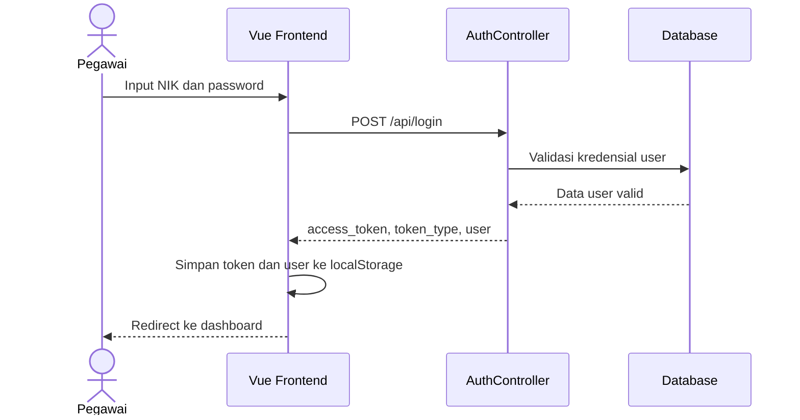
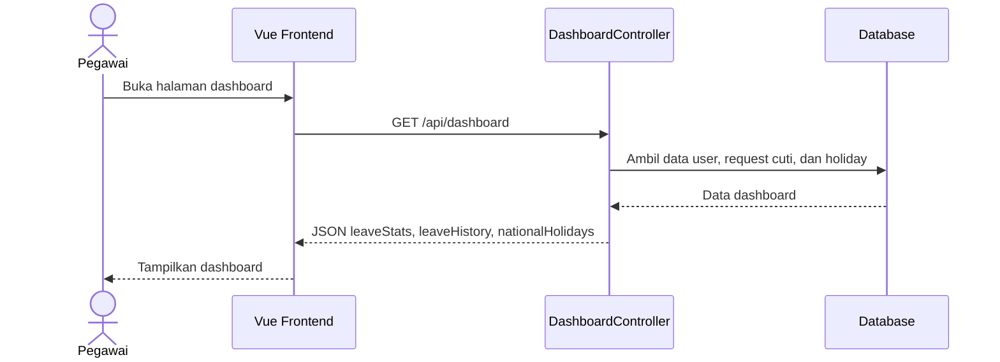
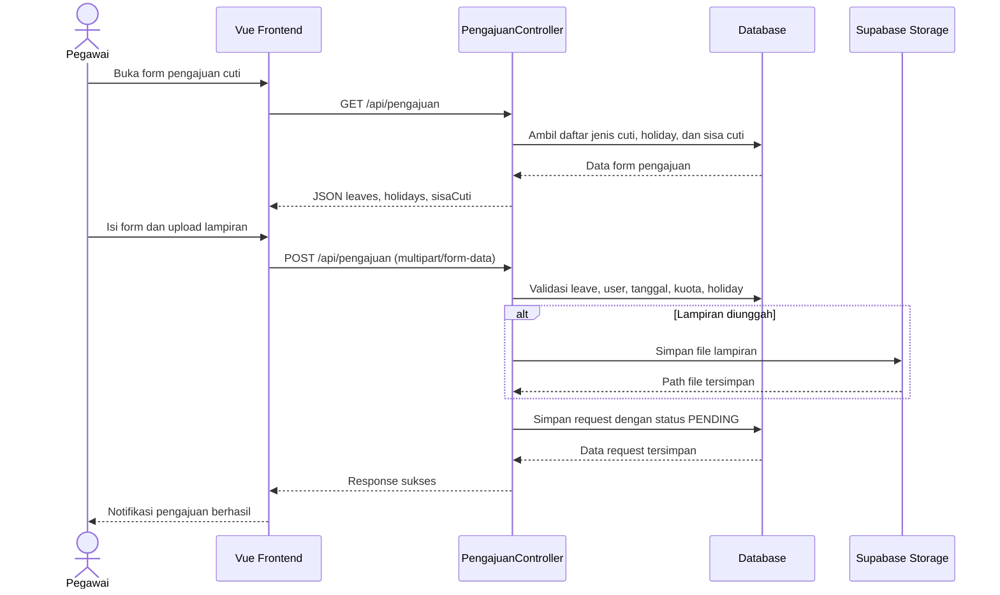
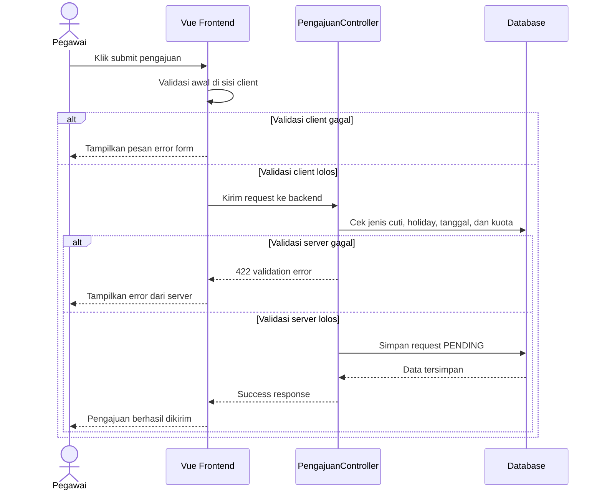
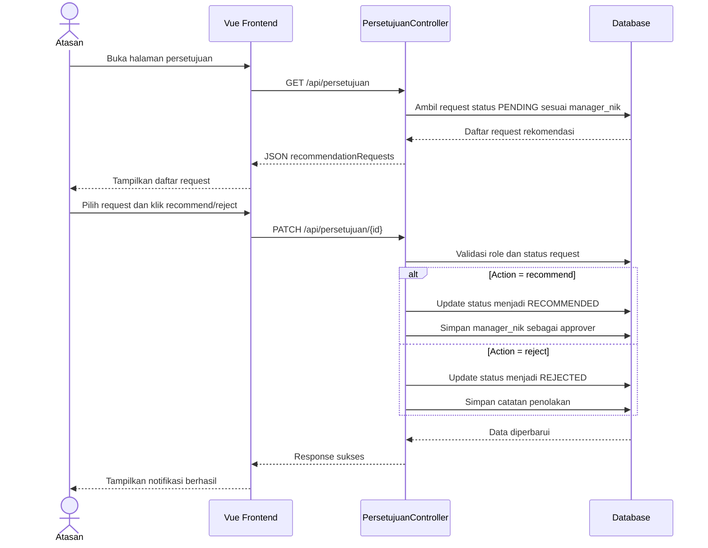
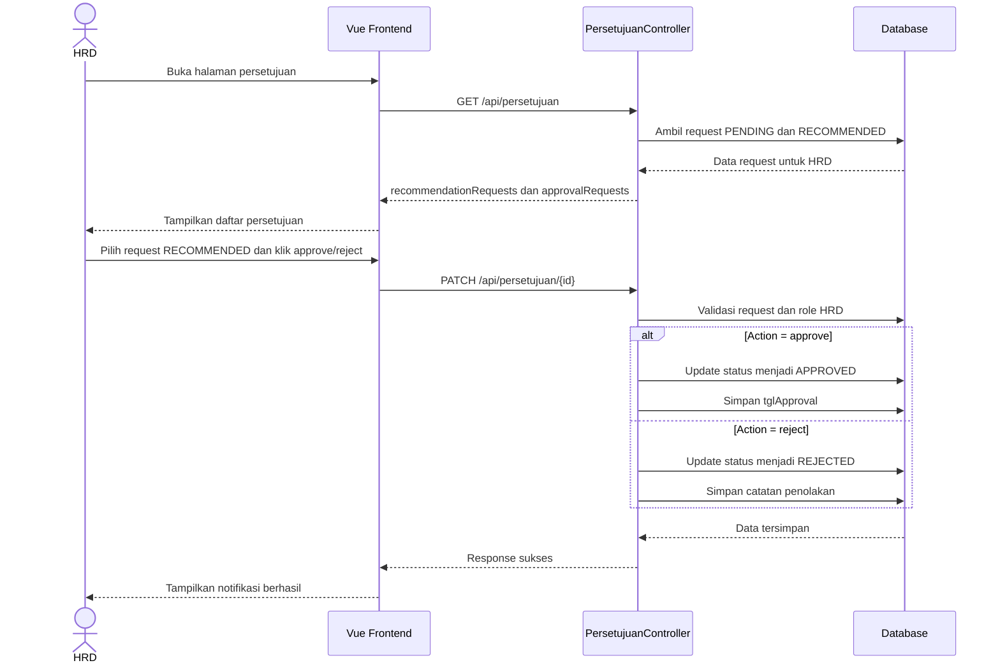
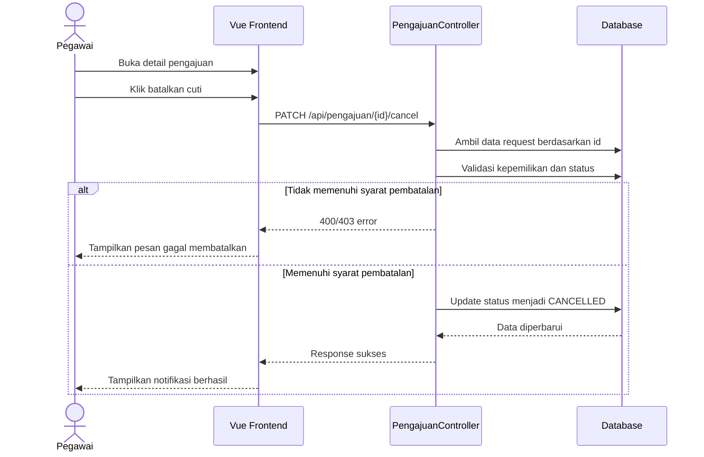
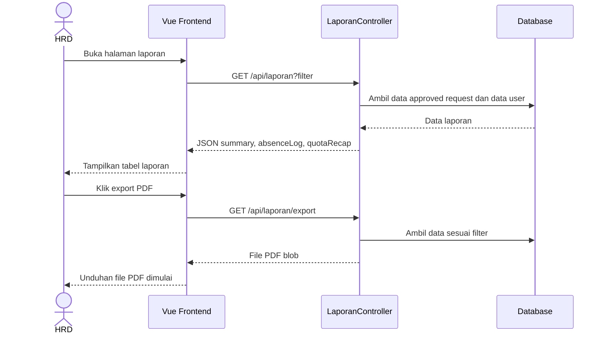
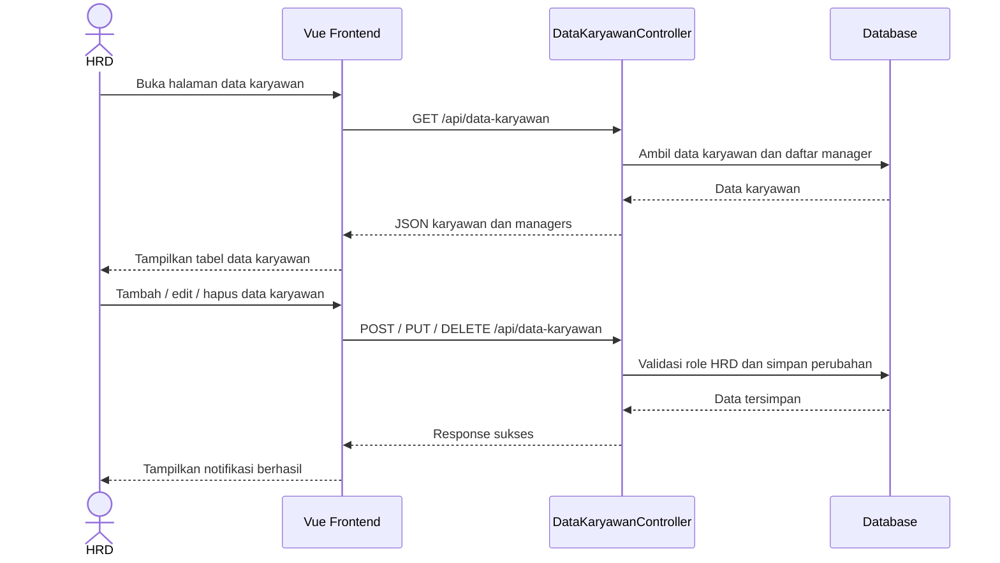

# Sequence Diagram Sistem Informasi Cuti SC

Dokumen ini memuat sequence diagram untuk alur utama yang teridentifikasi pada codebase aplikasi **SC**. Seluruh diagram ditulis menggunakan sintaks Mermaid.js agar dapat langsung dipindahkan ke dokumentasi teknis atau laporan akademik.

## 1. Sequence Diagram Login

## 2. Sequence Diagram Melihat Dashboard

## 3. Sequence Diagram Pengajuan Cuti

## 4. Sequence Diagram Validasi Pengajuan Cuti

## 5. Sequence Diagram Rekomendasi Cuti oleh Atasan

## 6. Sequence Diagram Approval Akhir oleh HRD

## 7. Sequence Diagram Pembatalan Cuti

## 8. Sequence Diagram Laporan Cuti

## 9. Sequence Diagram Manajemen Data Karyawan

## 10. Catatan Implementasi

- Diagram login, dashboard, pengajuan cuti, approval, pembatalan, laporan, dan data karyawan di atas disusun berdasarkan endpoint dan alur controller yang tersedia pada codebase.
- Jika ingin digunakan di dokumen Word, setiap code block Mermaid dapat ditempel langsung ke editor yang mendukung Mermaid atau dirender terlebih dahulu menjadi gambar.
- Alur approval dipisah menjadi dua sequence diagram karena implementasi backend membedakan rekomendasi oleh Atasan dan approval akhir oleh HRD.
